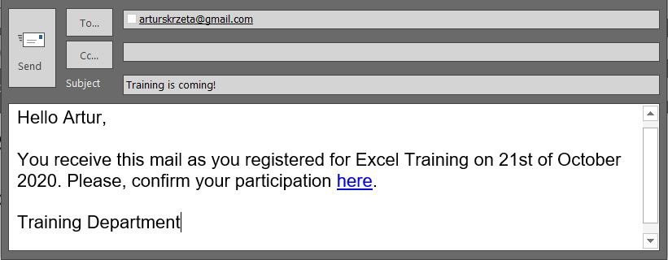

<h2>Bulk Mailing in Outlook with Python</h2>
<h3>Demo</h3>
<ul>
  <li>Mails divided into chunks.</li>
  <li>Each chunk can be distributed between recipients every 60 seconds.</li>
  <li>At first, mails are being saved to drafts from where they will be sent to recipients.</li>
  <li>Emails template are hard-coded into Python script.</li>
   
  
</ul>

